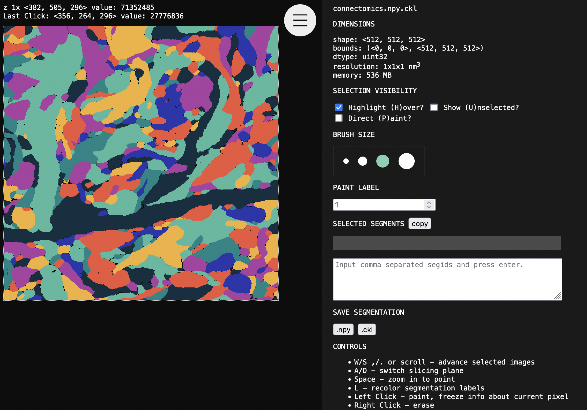
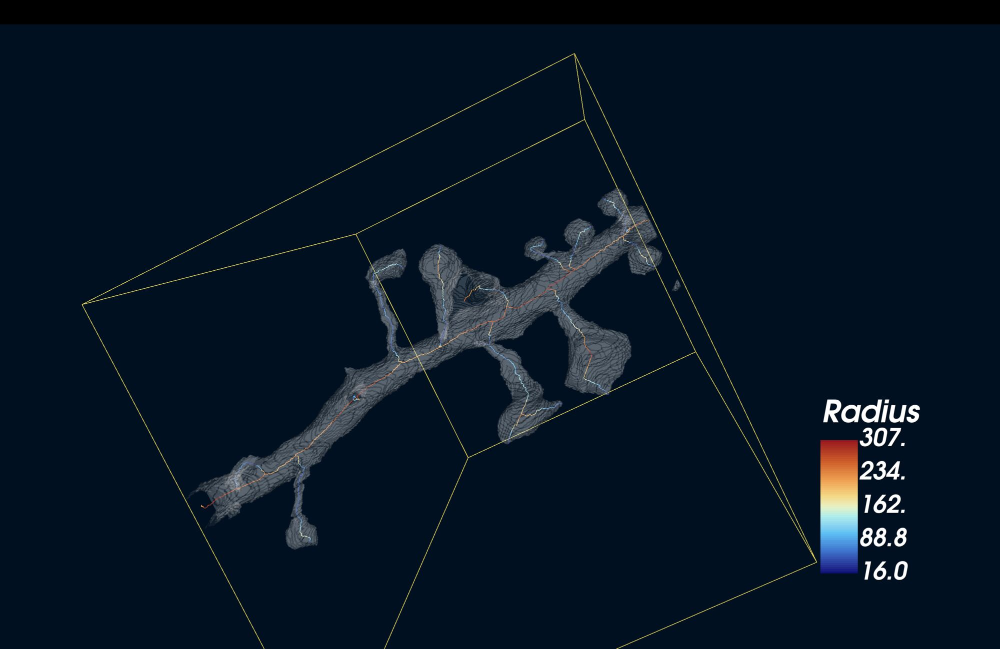

[](https://badge.fury.io/py/microviewer)

# microviewer
Multiplatform 3D numpy image browser based viewer.

```python
from microviewer import view, hyperview, objects

view(numpy_image) # for gray and color images
view(numpy_image, seg=True) # for segmentation labels
view(numpy_image, seg=True, port=8082)

hyperview(image, labels) # interactive overlay

# uses vtk to visualize meshes, bounding boxes, 
# skeletons, and point clouds
objects([ mesh, skeleton, bbox, point_cloud ])
```

```bash
uview image.npy.gz # view as image
uview labels.npy.gz --seg # view as segmentation
uview image.npy.gz labels.npy.gz # view image w/ overlay
uview image.npy.gz --paint # view image w/ blank overlay
```



Visualize 3D numpy arrays in your browser without difficult installation procedures or reformatting your data.  The code is CPU based and the image is uncompressed in memory. You're limited to images that are at most 2^31 bytes large (~2.1 GB) due to browser limitations.

## Features

- 3 axis visualization of 3D images.
- Grayscale images with segmentation overlay.
- Segmentation selection with brush tools.
- Direct voxel painting.
- Save segmentation as [.npy](https://numpy.org/neps/nep-0001-npy-format.html) or [.ckl](https://github.com/seung-lab/crackle), an advanced compresssion format.
- Undo/Redo

## 3D Image Support

- 8-bit grayscale 3D images
- color images (including 3 channel 3D images)
- floating point images
- boolean images
- segmentation labels
- .npy, .ckl, .nrrd, or .nii format

For .ckl, .nrrd, and .nii formats, you must install crackle-codec, pynrrd, and nibabel respectively. All are installed by the "all_formats" optional installation argument.

## 3D Object Support

- [osteoid](https://github.com/seung-lab/osteoid) Skeletons
	- Color By: Connected Component, Radius, Cross Sectional Area
- [zmesh](https://github.com/seung-lab/zmesh) and [CloudVolume](https://github.com/seung-lab/cloud-volume) Meshes
- Point Clouds
- Bounding Boxes

### Example

```python
import numpy as np
import zmesh
import kimimaro
import crackle
import microviewer
from osteoid.lib import Bbox

labels = crackle.load("connectomics.npy.ckl.gz", label=62347522)
resolution = np.array([16,16,40])

skel = kimimaro.skeletonize(
  labels, 
  teasar_params={
    'scale': 3,
    'pdrf_exponent': 8,
  },
  anisotropy=resolution,
)[1]

mesher = zmesh.Mesher(resolution)
mesher.mesh(labels)
mesh = mesher.get(1)

bbox = Bbox([0,0,0], np.array(labels.shape) * resolution)

microviewer.objects([ bbox, mesh, skel ], skeleton_color_by='radius')
```



## Installation

```bash
pip install microviewer
```

By default, only .npy files are supported. Additional formats are supported via optional downloads.

Possible optional arguments: 

`all_formats`, `nii`, `nrrd`, `ckl`, `jxl`,  
`objects`,  
`all`  

Note: jxl and objects have relatively heavy downloads.

```bash
pip install "microviewer[all]"
```

## History

This microviewer package has been a part of CloudVolume since 2018, but is now broken out into its own package for more flexible wider use. Microviewer uses a modified version of https://github.com/seung-lab/data-cube-x/ (2016) to represent the array in Javascript, which was originally developed for eyewire.org.


